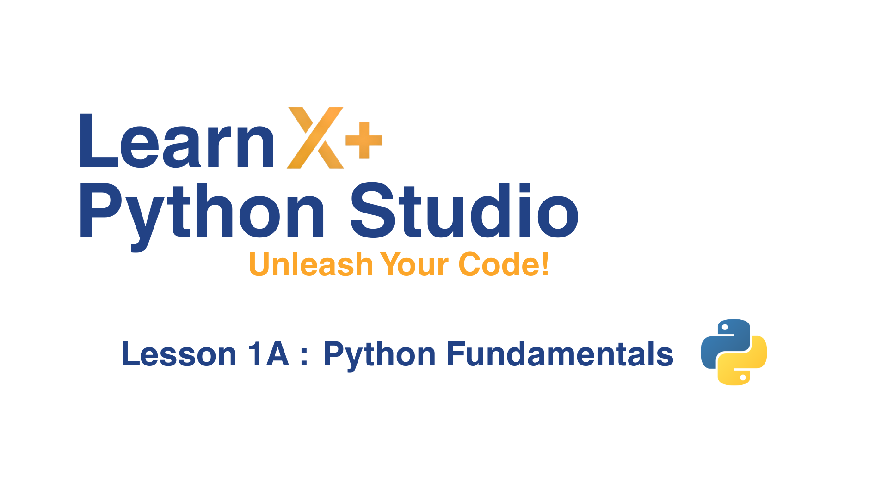
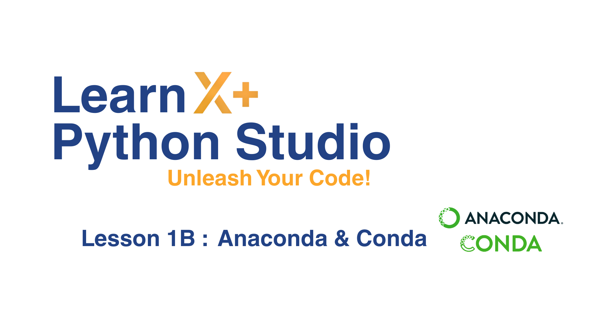
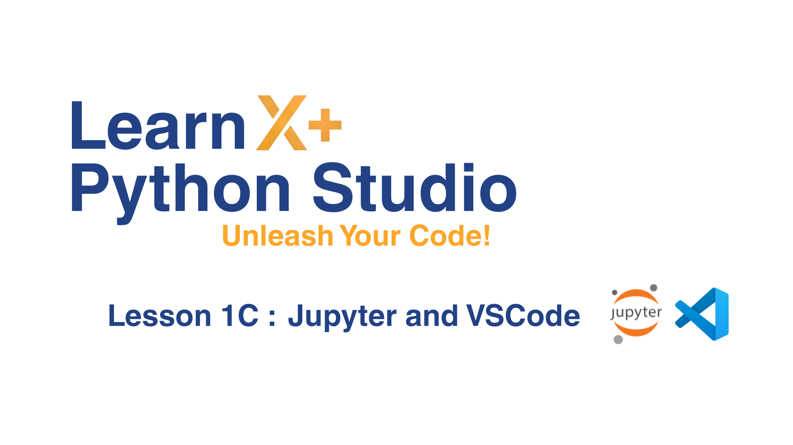

# ✨ Lesson 1 : Python, Conda, Jupyter & VS Code

Welcome to the first session of our Python workshop! 🐍   
In this lesson, we will **set up the essential tools and software** that will be used *throughout the whole programme*. ⚙️

By the end of this session, you should: 🚀
- Understand what Python is and why it is widely used
- Know how to manage environments using Conda
- Be able to run Python code using Jupyter Notebook
- Use VS Code as a powerful development environment

Please take out a laptop and **follow along the video tutorials! 💻** 

---

## 🐍 Lesson 1A : Python Fundamentals

[Watch the video here](https://youtu.be/NYC459pwBAw)

### Summary

The first lesson introduces you to what Python is and also a little bit of how it works under-the-hood. Then, discusses about what packages/ibraries are and how to install them. Finally, demonstrated creating a virtual environment, `venv` and also its downsides.

### Tasks
For this lesson, **not necessary** to follow along.

---

## 🪁 Lesson 1B : Conda

[Watch the video here](https://youtu.be/_doP2YcwArI)

The second lesson introduces you to Anaconda, a popular Python distribution platform for data-science libraries. Next, covered in-depth of how to use `conda` to install packages and also configure environments.

### Tasks
For this lesson, **please follow along**. By the end of the video, you should have :
- Installed Anaconda software.
- Understood conda environments.
- Created `projects` directory.
- Created `environment.yml` file within `projects` directory.
- Created `pys` conda environment by using `conda env create -f environment.yml --prune` command.

---

## 🪐 Lesson 1C : Jupyter & VSCode

[Watch the video here](https://youtu.be/Ne4IG-MmbmM)

The third lesson introduces Jupyter, an interactive development environment that is widely used in scientific computing and data science. Then, also introduces VS Code, the world's most populat IDE since it is so flexible and customisable.

### Tasks
For this lesson, **please follow along**. By the end of the video, you should have :
- Installed `jupyter` library in `pys` conda environment, via `environments.yml` file.
- Installed VS Code and customised it to your liking.
- Familiar with how to use Jupyter.
- Familiar with shortcuts on both IDEs.
- Understood how to switch between conda environments for Jupyter kernel.